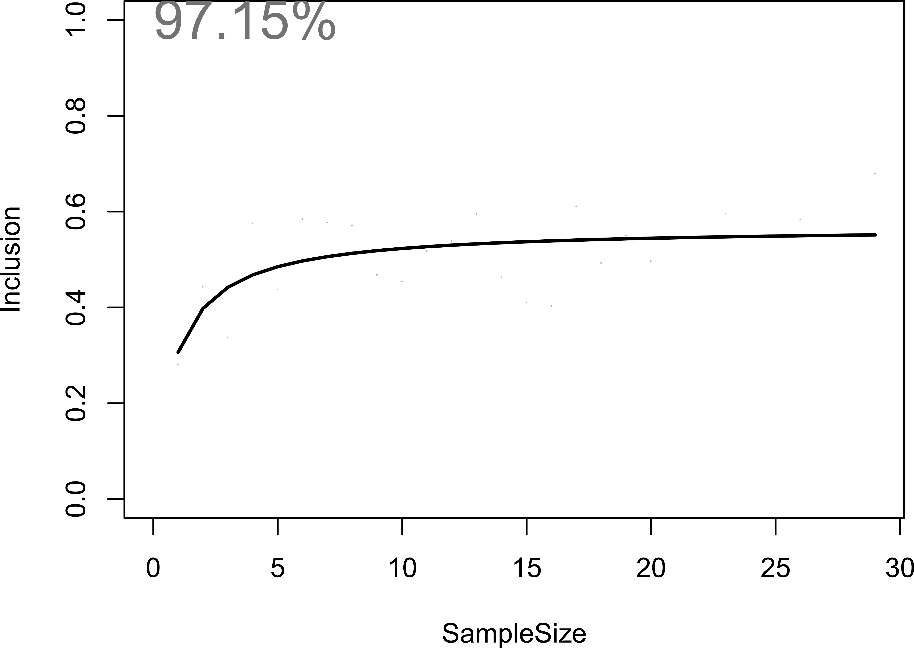
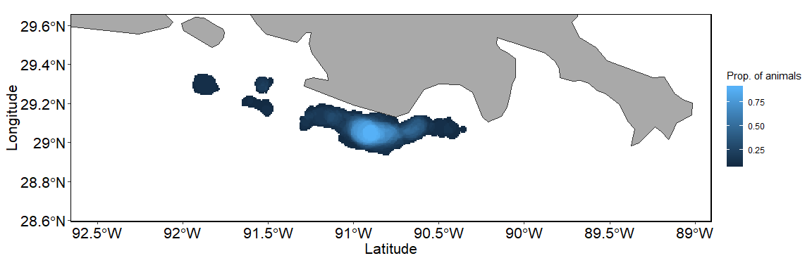

<!-- README.md is generated from README.Rmd. Please edit that file -->
track2KBA
=========

This package is comprised of functions that facilitate the identification of areas of importance for biodiversity, such as Key Biodiversity Areas (KBAs) or Ecologically or Biologically Significant Areas (EBSAs), based on individual tracking data. Key functions include utilities to identify and summarise individual foraging trips, estimate utilization distributions, and overlay distributions to identify important aggregation areas. Utility functions are also included to download Movebank data, format data sets, as well functions to assess sample representativeness and space use independence.

Installation
------------

You can download the development version from [GitHub](https://github.com/) with:

``` r
# install.packages("devtools")
devtools::install_github("steffenoppel/track2iba", auth_key=ASK MARTIN FOR THIS!, dependencies=TRUE)
```

Example
-------

The `formatFields` function allows you to specify which columns correspond to those necessary for track2KBA analysis; these are datetime field, latitude and longitude fields, and an ID field (i.e. individual animal, track, or trip).

In this example, we use a publicly available GPS dataset of Brown Pelicans, published in Geary et al. 2018, and stored in Movebank's data repository (<https://www.datarepository.movebank.org/>).

**SHOULD DO THIS WITH A SEABIRD TRACKING DATABASE EXAMPLE INSTEAD. INCLUDE THAT DATA WITH PACKAGE.**

``` r
library(track2KBA)
library(move)
dataset <- move::getDataRepositoryData("doi:10.5441/001/1.212g53s7/1")

tracks <- as.data.frame(dataset)

tracks_formatted <- formatFields(tracks, 
  field_ID = "deployment.id", 
  field_DateTime = "timestamps", 
  field_Lon = "location.long", 
  field_Lat = "location.lat"
  )

## basic example code
```

If your data come from a species which makes trips out from a centrally-located place, such as a nest in the case of a bird, or a beach colony in the case of a pinniped, you can use `tripSplit` to split up the data into discrete trips.

In order to do this, you must identify the location of the central place (e.g. nest or colony). In this case, we will use the first recorded location in the data, which is presumably from the capture location at the colony (**this could be wrong for these data though...**).

``` r
library(dplyr)
Colony <- tracks_formatted %>% 
  summarise(
    Longitude = first(Longitude), 
    Latitude = first(Latitude))
```

Our *Colony* dataframe tells us where trips originate from. Then we need to set some parameters to decide what constitutes a trip. To do that we should use our understanding of the movement ecology of the study species; Brown Pelicans belong to a coastal, nearshore species, and do not travel great distances on breeding season foraging trips. So in this case we set *InnerBuff* to 1 km, and *Duration* to 1 hour. *ReturnBuff* can be used to catch incomplete trips, where the animal began returning, but perhaps due to device failure the full trip wasn't captured. For short-ranging species with data from many trips this may be set to the same as *InnerBuff*.

Setting *rmColLocs* to TRUE will remove those points falling within the *InnerBuff*.

``` r
trips <- tripSplit(
  tracks = tracks_formatted, 
  Colony, 
  InnerBuff = 1, 
  ReturnBuff = 1, 
  Duration = 1, 
  plotit = T, 
  rmColLocs = T)
#> [1] "track 350152 does not return to the colony"
#> [1] "track 350840 does not return to the colony"
#> [1] "track 351069 does not return to the colony"
#> [1] "track 446024 does not return to the colony"
#> [1] "track 492261 does not return to the colony"
#> [1] "track 52254 does not return to the colony"
#> [1] "track 522825 does not return to the colony"
```


Then we can summarize the trip movements, using `tripSummary`.

``` r
tripSum <- tripSummary(Trips = trips, Colony = Colony)
#> Warning in tripSummary(Trips = trips, Colony = Colony): Some trips did not
#> return to the specified return buffer around the colony. The return date
#> given for these trips refers to the last location of the trip, and NOT the
#> actual return time to the colony.

tripSum
#> # A tibble: 1,453 x 10
#> # Groups:   ID [30]
#>    ID    trip_id n_locs departure           return              duration
#>    <chr> <chr>    <dbl> <dttm>              <dttm>                 <dbl>
#>  1 3501  35011       29 2014-05-13 23:15:08 2014-05-14 17:45:07    18.5 
#>  2 3501  350110       9 2014-05-24 20:30:11 2014-05-25 00:00:06     3.50
#>  3 3501  350111      21 2014-05-25 03:30:07 2014-05-25 17:15:23    13.8 
#>  4 3501  350112      24 2014-05-25 23:15:06 2014-05-26 14:00:23    14.8 
#>  5 3501  350113       7 2014-05-27 01:15:06 2014-05-27 02:45:07     1.50
#>  6 3501  350114       7 2014-05-27 22:45:07 2014-05-28 00:15:07     1.5 
#>  7 3501  350115      19 2014-05-28 04:45:12 2014-05-28 18:45:10    14.0 
#>  8 3501  350116      29 2014-05-29 00:45:23 2014-05-29 17:15:23    16.5 
#>  9 3501  350117      23 2014-05-30 16:15:07 2014-05-30 23:15:23     7.00
#> 10 3501  350118      13 2014-05-31 01:30:07 2014-05-31 04:30:07     3   
#> # ... with 1,443 more rows, and 4 more variables: total_dist <dbl>,
#> #   max_dist <dbl>, direction <dbl>, complete <chr>
```

Now that we have an idea how the animals are moving, we can start with the process of estimating their space use, and potential sites of aggregation!

`findScale` provides us with options for setting the all-important smoothing parameter in the Kernel Density Estimation.

If we know our animal uses area-restricted search to locate prey, then we can set the `ARSscale=T`. This will use First Passage Time analysis to identify the spatial scale at which area-restricted search is occuring.

``` r
HVALS <- findScale(trips,
  ARSscale = F,
  Colony = Colony,
  Trips_summary = tripSum)

HVALS
#>   med_max_dist  mag scaled_mag href ARSscale
#> 1        19.37 2.96       6.54 5.49       NA
```

The other values calculated relate to the number of points in the data (`href`) and to the average foraging range (`med_max_dist`) estimated from the trips present in the data (`mag` and `scaled_mag`).

Then, we select a smoothing parameter value, based on our understanding of the species movement ecology, as well as our understanding of the management context within which these movements occur.

(*IndEffectTest here. Doesn't work well, \[long run time\] with these many individual, GPS-data\]*)

Using this smoothing value, we can run Kernel Density Estimation for each individual, with `estSpaceUse`. We need to specify the isopleth at which level we want to use utilisation distributions - this is by default set to 50, as the 50% utilisation distribution (where an animal spends about half of its time) is commonly used to define an animal's 'core range' (Lascelles et al. 2016).

``` r
KDEs <- estSpaceUse(
  DataGroup = trips, 
  Scale = HVALS$mag, 
  UDLev = 50, 
  polyOut = T)
#> Warning in estSpaceUse(DataGroup = trips, Scale = HVALS$mag, UDLev = 50, : No grid resolution ('Res') was specified, or the specified resolution was >99 km and therefore ignored.
#>                   Space use was calculated on a 500-cell grid, with cells of 0.719 square km
```


This gives us an estimate of the core areas in which each individual spends time while on foraging trips. At this step we should verify that the smoothing parameter value we selected is producing reasonable space use estimates, given what we know about our study animals.

The next step is to estimate to what degree this tracked sample is representative of the larger population. That is, how well does the variation in space use of these tracked individuals encapsulate variation in the wider population? To do this, we use the `repAssess` function. This function repeatedly samples a number of individual home ranges, averages them together, and quantifies how many locations from the unselected individuals fall within this combined home range area. This process is repeated for each sample size, and iterated a chosen number of time, from 1 to the 1 less than the total number of individuals in the study sample.

To speed up this procedure, we can supply the results of `estSpaceUse`, which will be randomly sampled and recombined in each iteration. We choose the number of times we want to re-sample at each sample size by setting the `Iteration` argument.

``` r
repr <- repAssess(trips, Scale=HVALS$mag, Iteration=100, BootTable = F, Ncores = 5)
#> Warning in estSpaceUse(DataGroup = TripCoords, Scale = Scale, Res = Res, : No grid resolution ('Res') was specified, or the specified resolution was >99 km and therefore ignored.
#>                   Space use was calculated on a 500-cell grid, with cells of 0.719 square km
#> [1] "nls (non linear regression) successful, asymptote estimated for bootstrap sample."
```

The output is a table, with the estimated percentage of representativeness given in the `out` column.

The relationship between sample size and the inclusion of un-tested animals' space use areas is visualized via this automatic output plot, which is saved to the working directoty (i.e. `getwd()`). By quantifying this relationship across a range of different sample sizes, we can estimate how close we are to an information asymptote. Put another way, we estimate how much new space use information would be added by including more animals in the sample. In the case of this Brown Pelican dataset, we estimate that ~97% of the space used by this population is captured by the sample of 29 individuals. Highly representative!



Using the space use estimates of each individual, we can now calculate where they overlap in space. Then, by including the representativeness value, we can estimate the proportion of the larger population using a given area and check whether this proportion meets threshold of importance at the population level. Here, if we have population size estimates, we can include this value to output a number of individuals aggregating in a given space instead of proportions, which can then use to compare against importance criteria (i.e KBA, EBSA criteria).

If you desire polygon output, instead of a raster surface, you can indicate this using the `polyOut` argument. This aggregates all cells with the same estimated number of individuals into to sinlgle polygons. If you stipulate `plotit=T` a plot will be produced (as below) showing all the polygons which meet the threshold proportion of birds using the area. If instead you just want the raster density distribution surface, simply use `plotit=F`.

``` r
KBAs <- findKBA(
  KDE.Surface = KDEs,
  Represent = repr$out,
  UDLev = 50,
  polyOut = T,
  plotit = T)
#> Warning in findKBA(KDE.Surface = KDEs, Represent = repr$out, UDLev = 50, :
#> No value for colony size provided. Output for N_animals is in % of colony
#> size
#> Scale for 'fill' is already present. Adding another scale for 'fill',
#> which will replace the existing scale.
```



Since the output is in Simple Features (sf) visualizing these data is simple.

To visualize either the polygons or the density surface. just use `plot(KBA)`.
