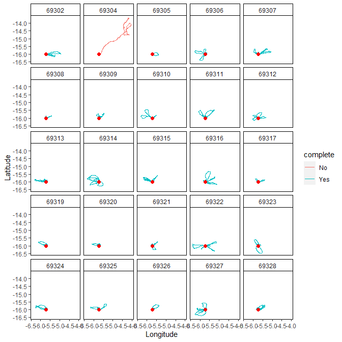
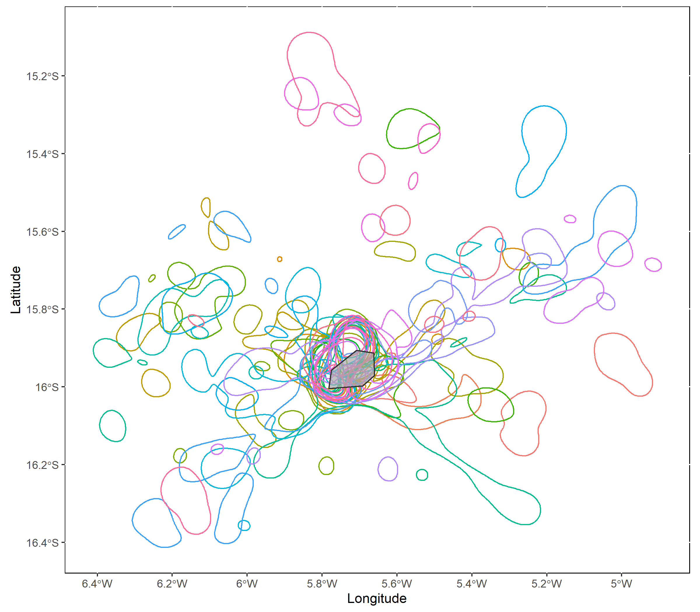
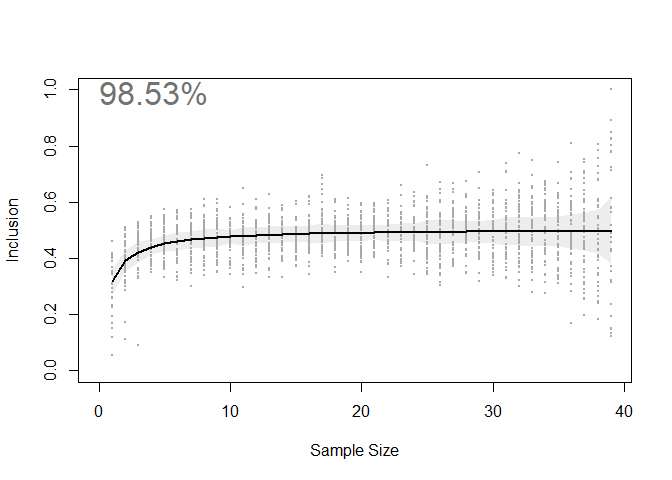
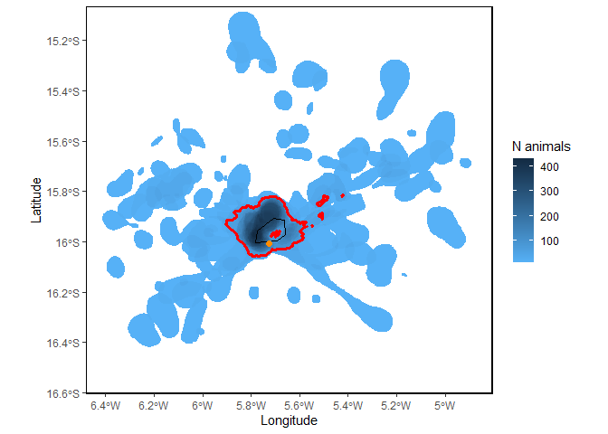

# track2KBA 

<!-- README.md is generated from README.Rmd. Please edit that file -->

[](https://zenodo.org/badge/latestdoi/170969026)
<!-- badges: start -->
[](https://github.com/BirdLifeInternational/track2kba/actions)
[](https://app.codecov.io/gh/BirdLifeInternational/track2kba)
[](https://cran.r-project.org/package=track2KBA)
[](https://cran.r-project.org/package=track2KBA)
<!-- badges: end -->

This package is comprised of functions that facilitate the
identification of areas of importance for biodiversity, such as Key
Biodiversity Areas (KBAs), based on individual tracking data. For
further detail concerning the method itself, please refer to this
[paper](https://doi.org/10.1111/2041-210X.13713) by Beal et al. (2021).

Key functions include utilities to estimate individual core use areas,
the level of representativeness of the tracked sample, and overlay
individual distributions to identify important sites at the population
level. Other functions assist in plotting the results, formatting your
data set, and splitting and summarizing individual foraging trips.

## Installation

------------------------------------------------------------------------

You can download the stable version from CRAN with:

``` r
install.packages("track2KBA")
```

Or you can download the development version from
[GitHub](https://github.com/) with:

``` r
install.packages("devtools", dependencies = TRUE) 
devtools::install_github("BirdLifeInternational/track2kba", dependencies=TRUE) # development version - add argument 'build_vignettes = FALSE' to speed it up 
```

### Example

------------------------------------------------------------------------

Now we will use tracking data collected at a seabird breeding colony to
illustrate a `track2KBA` workflow for identifying important sites. It is
important to note that the specific workflow you use (i.e., which
functions and in what order) will depend on the species of interest and
the associated data at hand.

First, in order for the data to work in `track2KBA` functions, we can
use the `formatFields` function to format the important data columns
needed for analysis. These are: a DateTime field, Latitude and Longitude
fields, and an ID field (i.e. individual animal, track, or trip).

``` r
library(track2KBA) # load package

data(boobies)
# ?boobies  # for some background info on the example data set 

dataGroup <- formatFields(
  dataGroup = boobies, 
  fieldID   = "track_id", 
  fieldDate = "date_gmt", 
  fieldTime = "time_gmt",
  fieldLon  = "longitude", 
  fieldLat  = "latitude"
  )

str(dataGroup)
```

If your data come from a central-place foraging species (i.e. one which
makes trips out from a centrally-located place, such as a nest in the
case of a bird), you can use `tripSplit` to split up the data into
discrete trips.

In order to do this, you must identify the location(s) of the central
place(s) (e.g. colony-center, or nest sites).

``` r
library(dplyr)

# here we know that the first points in the data set are from the colony center
colony <- dataGroup %>% 
  summarise(
    Longitude = first(Longitude), 
    Latitude  = first(Latitude)
    )
```

Our *colony* dataframe tells us where trips originate from. Then we can
set some parameters to decide what constitutes a trip. To do that we
should use our understanding of the movement ecology of the study
species. In this case we know our seabird travels out to sea on the
scale of tens of kilometers, so we set *innerBuff* (the minimum distance
from the colony) to 3 km, and *duration* (minimum trip duration) to 1
hour. *returnBuff* can be set further out in order to catch incomplete
trips, where the animal began returning, but perhaps due to device
failure the full trip wasn’t captured.

Optionally, we can set *rmNonTrip* to TRUE which will remove the periods
when the animals were not on trips. The results of `tripSplit` can be
plotted using `mapTrips` to see some examples of trips.

``` r
str(dataGroup)

trips <- tripSplit(
  dataGroup  = dataGroup,
  colony     = colony,
  innerBuff  = 3,      # kilometers
  returnBuff = 10,
  duration   = 1,      # hours
  rmNonTrip  = TRUE
  )

mapTrips(trips = trips, colony = colony)
```



Then we can summarize the trip movements, using `tripSummary`. First, we
can filter out data from trips that did not return to the vicinity of
the colony (i.e. within *returnBuff*), so they don’t skew the estimates.

``` r
trips <- subset(trips, trips$Returns == "Yes" )

sumTrips <- tripSummary(trips = trips, colony = colony)

sumTrips
```

Now that we have an idea how the animals are moving, we can start with
the process of estimating their space use areas, and identifying
potentially important sites for the population!

`track2KBA` uses Kernel Density Estimation (KDE) to produce space use
estimates for each individual track. In order for these to be accurate,
we need to transform the tracking data to an equal-area projection. We
can use the convenience function `projectTracks` to perform this
projection. We can select between an azimuthal or cylindrical
projection, and decide whether to center the projection on the data
itself. Custom-centering is generally a good idea for quick analyses as
this will minimize distortion, however it is important to remember that
the resulting projection will be data specific. So if you remove even
one track and re-analyze, the projection will differ between datasets.
For formal analysis, the best solution is to find a standard projection
that is appropriate for your study region.

``` r
tracks <- projectTracks( dataGroup = trips, projType = 'azim', custom=TRUE )
class(tracks)
```

`findScale` provides options for setting the all-important smoothing
parameter in the KDE. This parameter decisions is of the utmost
importance, as it determines the scale at which the tracking locations
will be ‘smoothed’ into an estimate of the probability of use of space
by the animal. `findScale` calculates candidate smoothing parameter
values using several different methods.

If we know our animal uses an area-restricted search (ARS) strategy to
locate prey, then we can set the `scaleARS=TRUE`. This uses First
Passage Time analysis to identify the spatial scale at which
area-restricted search is occuring, which may then be used as the
smoothing parameter value.

``` r
hVals <- findScale(
  tracks   = tracks,
  scaleARS = TRUE,
  sumTrips = sumTrips)

hVals
```

The other values provided by `findScale` are more simplistic methods of
calculating the smoothing parameter. `href` is the canonical reference
method, and relates to the number of points in the data and their
spatial variance. `mag` is the log of the average foraging range
(`med_max_dist` in the *sumTrips* output); this methods only works for
central-place foragers.

Next, we must select a smoothing parameter value. To inform our
decision, we ought to use our understanding of the species’ movement
ecology to guide our decision about what scale make sense. That is, from
the `findScale` output, we want to avoid using values which may under-
or over-represent the area used by the animals while foraging.

Once we have chosen a smoothing value, we can produce KDEs for each
individual, using `estSpaceUse`. By default this function isolates the
core range of each track (i.e. the 50% utilization distribution, or
where the animal spends about half of its time) which is a commonly used
standard (Lascelles et al. 2016). However, another quantile can be chose
using the `levelUD` argument, or the full utilization distritbution can
be returned using `polyOut=FALSE`.

The resulting KDEs can be plotted using mapKDE, which if `polyOut=TRUE`
shows each tracks’s core range in a different color.

*Note*: here we might want to remove the trip start and end points that
fall within the *innerBuff* (i.e. 3 km) we set in `tripSplit`, so that
they don’t skew the at-sea distribution towards to colony.

``` r
tracks <- tracks[tracks$ColDist > 3, ] # remove trip start and end points near colony

KDE <- estSpaceUse(
  tracks = tracks, 
  scale = hVals$mag, 
  levelUD = 50, 
  polyOut = TRUE
  )

mapKDE(KDE = KDE$UDPolygons, colony = colony)
```


At this step we should verify that the smoothing parameter value we
selected is producing reasonable space use estimates, given what we know
about our study animals. Are the core areas much larger than expected?
Much smaller? If so, consider using a different value for the `scale`
parameter.

The next step is to estimate how representative this sample of animals
is of the population. That is, how well does the variation in space use
of this sample of tracks encapsulate variation in the wider population?
To do this we can use the `repAssess` function. This function repeatedly
samples a subset of track core ranges, averages them together, and
quantifies how many points from the unselected tracks fall within this
combined core range area. This process is run across the range of the
sample size, and iterated a chosen number of times.

To do this, we need to supply Utilization Distributions to `repAssess`
(e.g., the output of `estSpaceUse`) and the tracking data. We can choose
the number of times we want to re-sample at each sample size by setting
the `iteration` argument. The higher the number the more confident we
can be in the results, but the longer it will take to compute.

``` r
repr <- repAssess(
  tracks    = tracks, 
  KDE       = KDE$KDE.Surface,
  levelUD   = 50,
  iteration = 1, 
  bootTable = FALSE)
```

The output is a dataframe, with the estimated percentage of
representativeness given in the `out` column.

The relationship between sample size and the percent coverage of
un-tested animals’ space use areas (i.e. *Inclusion*) is visualized in
the output plot seen below.

By quantifying this relationship, we can estimate how close we are to an
information asymptote. Put another way, we have estimated how much new
space use information would be added by tracking more animals. In the
case of this seabird dataset, we estimate that \~98% of the core areas
used by this population are captured by the sample of 39 individuals.
Highly representative!



Now, using `findSite` we can identify areas where animals are
overlapping in space and delineate sites that meet some criteria of
importance. Using the core area estimates of each individual track we
can calculate where they overlap. Then, we estimate the proportion of
the larger population in a given area by adjusting our overlap estimate
based on the degree of representativeness.

Here, if we have population size estimates, we can include this value
(using the `popSize` argument) to estimate the number of individuals
using a space, which can then use to compare against population-level
importance criteria (e.g. KBA criteria). If we don’t have population
size estimates to provide, `findSite` this will output a proportion of
the population instead.

If you desire polygon output of the overlap areas, instead of a gridded
surface, you can indicate this using the `polyOut` argument.

``` r
Site <- findSite(
  KDE = KDE$KDE.Surface,
  represent = repr$out,
  levelUD = 50,
  popSize = 500,     # 500 individual seabirds breed one the island
  polyOut = TRUE
  )

class(Site)
```

If we specified `polyOut=TRUE`, then the output will be of Simple
Features class, which allows us to easily take advantage of the
`ggplot2` plotting syntax to make an attractive map using `mapSite`!

``` r
Sitemap <- mapSite(Site, colony = colony)
## in case you want to save the plot
# ggplot2::ggsave("KBAmap", device="png")
```



This map shows the number or proportion of individual animals in the
population overlapping in space. The red lines indicate the ‘potential
site’; that is, the areas used by a significant proportion of the local
population, given the representativeness of the sample of tracked
individuals. In this case, since representativeness is \>90%, any area
used by 10% or more of the population is considered important (see
Lascelles et al. 2016 for details). The orange dot is the colony
location and the black line is the coastline.

Note: it is possible to set the threshold of importance at the
population level yourself, using the `thresh` argument. Just be aware
that this is a crucial threshold parameter that will need justifying if
you are to eventually recommend a site for formal acknowledgement as an
important site for conservation.

Then, we can combine all the polygons within the ‘potentialSite’ area,
and use, for example, the maximum number of individuals present in that
area to assess whether it may merits identification as a Key
Biodiversity Area according to the KBA standard.

``` r
potSite <- Site %>% dplyr::filter(.data$potentialSite==TRUE) %>% 
   summarise(
     max_animals = max(na.omit(N_animals)), # maximum number of animals aggregating in the site
     min_animals = min(na.omit(N_animals))  # minimum number using the site
   )
```

If in `findSite` we instead specify `polyOut=FALSE`, our output will be
a spatial grid of animal densities, with each cell representing the
estimated number, or percentage of animals using that area. So this
output is independent of the representativness-based importance
threshold.

``` r
mapSite(Site, colony = colony)
```


This plot shows the minimum estimated number of birds using the space
around the breeding island.

------------------------------------------------------------------------

### Package reference

If you use any functions in this package for your work, please use the
following citation:

Beal, M., Oppel, S., Handley, J., Pearmain, E. J., Morera-Pujol, V.,
Carneiro, A. P. B., Davies, T. E., Phillips, R. A., Taylor, P. R.,
Miller, M. G. R., Franco, A. M. A., Catry, I., Patrício, A. R., Regalla,
A., Staniland, I., Boyd, C., Catry, P., & Dias, M. P. (2021). track2KBA:
An R package for identifying important sites for biodiversity from
tracking data. Methods in Ecology and Evolution, n/a(n/a).
<https://doi.org/10.1111/2041-210X.13713>

### Example data reference

Oppel, S., Beard, A., Fox, D., Mackley, E., Leat, E., Henry, L.,
Clingham, E., Fowler, N., Sim, J., Sommerfeld, J., Weber, N., Weber, S.,
Bolton, M., 2015. *Foraging distribution of a tropical seabird supports
Ashmole’s hypothesis of population regulation. Behav Ecol Sociobiol 69,
915–926. <https://doi.org/10.1007/s00265-015-1903-3>*

### Other references

Lascelles, B. G., Taylor, P. R., Miller, M. G. R., Dias, M. P., Oppel,
S., Torres, L., Hedd, A., Corre, M. L., Phillips, R. A., Shaffer, S. A.,
Weimerskirch, H., & Small, C. (2016). Applying global criteria to
tracking data to define important areas for marine conservation.
Diversity and Distributions, 22(4), 422–431.
<https://doi.org/10.1111/ddi.12411>

### Acknowledgements

Thanks to Annalea Beard for kindly sharing these example data for use in
the package.

This project has received funding from the European Union’s Horizon 2020
research and innovation programme under the Marie Skłodowska-Curie grant
agreement No 766417.
