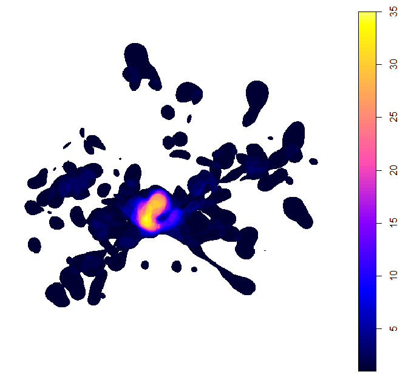

<!-- README.md is generated from README.Rmd. Please edit that file -->
track2KBA
=========

This package is comprised of functions that facilitate the identification of areas of importance for biodiversity, such as Key Biodiversity Areas (KBAs) or Ecologically or Biologically Significant Areas (EBSAs), based on individual tracking data. Key functions include utilities to identify and summarise individual foraging trips, estimate utilization distributions, and overlay distributions to identify important aggregation areas. Utility functions are also included to download Movebank data, format data sets, as well functions to assess sample representativeness and space use independence.

Installation
------------

You can download the development version from [GitHub](https://github.com/) with:

``` r
# install.packages("devtools")
devtools::install_github("steffenoppel/track2iba", auth_key=ASK MARTIN FOR THIS!, dependencies=TRUE)
```

Example
-------

The `formatFields` function allows you to specify which columns in your data set correspond to the necessary fields for track2KBA analysis and re-format them. These are: a datetime field, latitude and longitude fields, and an ID field (i.e. individual animal, track, or trip).

In this example, we use a tracking data set from Masked Boobies breeding on St. Helena Island in the Atlantic Ocean. These data are published in a study which may be found here:

``` r
library(track2KBA)

data(boobies)
# ?boobies  # for some background on the data set 

tracks <- formatFields(boobies, 
  field_ID = "track_id", 
  field_Date = "date_gmt", 
  field_Time = "time_gmt",
  field_Lon = "longitude", 
  field_Lat = "latitude"
  )
#> Warning in formatFields(boobies, field_ID = "track_id", field_Date =
#> "date_gmt", : No format was supplied for the input Date and Time fields,
#> a default format ('ymd_HMS') was attempted when combining the fields. If
#> an error is produced, see help page ('?lubridate::parse_date_time') for
#> information on date formats.

## basic example code
```

If your data come from a species which makes trips out from a centrally-located place, such as a nest in the case of a bird, or a beach colony in the case of a pinniped, you can use `tripSplit` to split up the data into discrete trips.

In order to do this, you must identify the location of the central place (e.g. nest or colony).

``` r
library(dplyr)

colony <- tracks %>% 
  summarise(
    Longitude = first(Longitude), 
    Latitude = first(Latitude))
```

Our *colony* dataframe tells us where trips originate from. Then we need to set some parameters to decide what constitutes a trip. To do that we should use our understanding of the movement ecology of the study species; Brown Pelicans belong to a coastal, nearshore species, and do not travel great distances on breeding season foraging trips. So in this case we set *InnerBuff* to 1 km, and *Duration* to 1 hour. *ReturnBuff* can be used to catch incomplete trips, where the animal began returning, but perhaps due to device failure the full trip wasn't captured. For short-ranging species with data from many trips this may be set to the same as *InnerBuff*.

Setting *rmColLocs* to TRUE will remove those points falling within the *InnerBuff*.

``` r
trips <- tripSplit(
  tracks = tracks, 
  Colony = colony, 
  InnerBuff = 3, 
  ReturnBuff = 10, 
  Duration = 1, 
  plotit = TRUE, 
  rmColLocs = TRUE)
#> [1] "track 693041 does not return to the colony"
#> [1] "track 693434 does not return to the colony"
```


Then we can summarize the trip movements, using `tripSummary`.

``` r
tripSum <- tripSummary(Trips = trips, Colony = colony)
#> Warning in tripSummary(Trips = trips, Colony = colony): Some trips did not
#> return to the specified return buffer around the colony. The return date
#> given for these trips refers to the last location of the trip, and NOT the
#> actual return time to the colony.

tripSum
#> # A tibble: 215 x 10
#> # Groups:   ID [41]
#>    ID    trip_id n_locs departure           return              duration
#>    <chr> <chr>    <dbl> <dttm>              <dttm>                 <dbl>
#>  1 69302 693021     274 2012-07-22 07:52:11 2012-07-22 16:11:03     8.31
#>  2 69302 693022     124 2012-07-23 12:26:22 2012-07-23 15:54:05     3.46
#>  3 69302 693023     138 2012-07-25 08:30:53 2012-07-25 12:22:53     3.87
#>  4 69304 693041    1268 2013-08-22 11:50:41 2013-08-24 23:03:50    NA   
#>  5 69305 693051      71 2013-08-22 13:08:15 2013-08-22 15:10:59     2.05
#>  6 69306 693061      37 2014-01-06 16:28:42 2014-01-06 17:32:11     1.06
#>  7 69306 693062      83 2014-01-07 14:48:24 2014-01-07 17:10:21     2.37
#>  8 69306 693063     129 2014-01-08 14:25:11 2014-01-08 17:55:22     3.50
#>  9 69306 693064      50 2014-01-08 18:08:32 2014-01-08 19:30:40     1.37
#> 10 69306 693065     155 2014-01-09 14:47:04 2014-01-09 19:21:32     4.57
#> # ... with 205 more rows, and 4 more variables: total_dist <dbl>,
#> #   max_dist <dbl>, direction <dbl>, complete <chr>
```

Now that we have an idea how the animals are moving, we can start with the process of estimating their space use, and potential sites of aggregation!

`findScale` provides options for setting the all-important smoothing parameter in the Kernel Density Estimation. It calculates candidate smoothing parameters using several different methods.

If we know our animal uses area-restricted search to locate prey, then we can set the `ARSscale=TRUE`. This uses First Passage Time analysis to identify the spatial scale at which area-restricted search is occuring, which may be used as the smoothing parameter value.

``` r
Hvals <- findScale(trips,
  ARSscale = TRUE,
  Colony = Colony,
  Trips_summary = tripSum)
#> Warning in findScale(trips, ARSscale = TRUE, Colony = Colony, Trips_summary
#> = tripSum): No grid resolution ('Res') was specified, or the specified
#> resolution was >99 km and therefore ignored. Movement scale in the data was
#> compared to a 500-cell grid with cell size of 0.701 km squared.
#> Warning in if ((FirstPeak == Scales[length(Scales) - 1]) & (FirstPeak == :
#> the condition has length > 1 and only the first element will be used

#> Warning in if ((FirstPeak == Scales[length(Scales) - 1]) & (FirstPeak == :
#> the condition has length > 1 and only the first element will be used
#> [1] "No peak was found for: ID 69309"
#> Warning in if ((FirstPeak == Scales[length(Scales) - 1]) & (FirstPeak == :
#> the condition has length > 1 and only the first element will be used
#> [1] "No peak was found for: ID 69314"
#> Warning in if ((FirstPeak == Scales[length(Scales) - 1]) & (FirstPeak == :
#> the condition has length > 1 and only the first element will be used
#> [1] "No peak was found for: ID 69328"
#> [1] "No peak was found for: ID 69330"
#> [1] "No peak was found for: ID 69332"
#> Warning in if ((FirstPeak == Scales[length(Scales) - 1]) & (FirstPeak == :
#> the condition has length > 1 and only the first element will be used

#> Warning in if ((FirstPeak == Scales[length(Scales) - 1]) & (FirstPeak == :
#> the condition has length > 1 and only the first element will be used

Hvals
#>   med_max_dist  mag scaled_mag href ARSscale
#> 1        24.73 3.21        7.7 7.51    20.76
```

The other values are more simplistic methods of calculating the smoothing parameter. `href` is the canonical method, and relates to the number of points in the data and their spatial variance. `mag` and `scaled_mag` are based on the average foraging range (`med_max_dist`) estimated from the trips present in the data. These two methods only work when data are split into discrete trips.

Then, we must select a smoothing parameter value. To inform our decision, we ought to use our understanding of the species movement ecology, as well as the management context within which these movements occur. That is, knowing how the animal moves, and what scale of area can be logically managed in the given context, we can exclude candidate smoothing values from `findScale` which may over- or under-represent the area used by the animals.

Once we have chosen a smoothing value, we can produce Kernel Density Estimations for each individual, using `estSpaceUse`. By default this function isolates each animals cores range (i.e. the 50% utilization distribution, or where the animal spends about half of its time) which is a commonly used standard (Lascelles et al. 2016). This can easily be adjusted using the `UDLev` argument.

``` r
KDEs <- estSpaceUse(
  DataGroup = trips, 
  Scale = Hvals$mag, 
  UDLev = 50, 
  polyOut = TRUE)
#> Warning in estSpaceUse(DataGroup = trips, Scale = Hvals$mag, UDLev = 50, : No grid resolution ('Res') was specified, or the specified resolution was >99 km and therefore ignored.
#>                   Space use was calculated on a 500-cell grid, with cells of 0.727 square km
```


At this step we should verify that the smoothing parameter value we selected is producing reasonable space use estimates, given what we know about our study animals.

The next step is to estimate to what degree this tracked sample is representative of the larger population. That is, how well does the variation in space use of these tracked individuals encapsulate variation in the wider population? To do this, we use the `repAssess` function. This function repeatedly samples a number of individual core ranges, averages them together, and quantifies how many point locations from the unselected individuals fall within this combined core range area. This process is repeated for each sample size, and iterated a chosen number of times.

To speed up this procedure, we can supply the output of `estSpaceUse`, which will be randomly sampled and recombined in each iteration. We choose the number of times we want to re-sample at each sample size by setting the `Iteration` argument. The higher, the more confident we can be in the results, but the longer it will take to compute.

``` r
KDEs
#> $KDE.Surface
#> ********** Utilization distribution of several Animals ************
#> 
#> Type: probability density
#> Smoothing parameter estimated with a  specified smoothing parameter
#> This object is a list with one component per animal.
#> Each component is an object of class estUD
#> See estUD-class for more information
#> 
#> 
#> $UDPolygons
#> Simple feature collection with 41 features and 2 fields
#> geometry type:  MULTIPOLYGON
#> dimension:      XY
#> bbox:           xmin: -6.411805 ymin: -16.87262 xmax: -4.103352 ymax: -13.63024
#> epsg (SRID):    4326
#> proj4string:    +proj=longlat +datum=WGS84 +no_defs
#> First 10 features:
#>          id     area                       geometry
#> 69302 69302 477.2619 MULTIPOLYGON (((-5.691109 -...
#> 69304 69304 532.2372 MULTIPOLYGON (((-4.472789 -...
#> 69305 69305 305.7677 MULTIPOLYGON (((-5.704768 -...
#> 69306 69306 435.9407 MULTIPOLYGON (((-6.267572 -...
#> 69307 69307 424.6913 MULTIPOLYGON (((-5.920609 -...
#> 69308 69308 187.0009 MULTIPOLYGON (((-5.799668 -...
#> 69309 69309 187.6590 MULTIPOLYGON (((-5.806514 -...
#> 69310 69310 721.4156 MULTIPOLYGON (((-6.34918 -1...
#> 69311 69311 402.9683 MULTIPOLYGON (((-5.92123 -1...
#> 69312 69312 781.6377 MULTIPOLYGON (((-6.031113 -...
repr <- repAssess(trips, listKDE = KDEs$KDE.Surface, Scale = Hvals$mag, Iteration = 1, BootTable = FALSE)
#> [1] "nls (non linear regression) successful, asymptote estimated for bootstrap sample."
```

The output is a dataframe, with the estimated percentage of representativeness given in the `out` column.

The relationship between sample size and the inclusion of un-tested animals' space use areas is visualized via the output plot seen below, which is automatically saved to the working directoty (i.e. `getwd()`) each time `repAssess` is run.

By quantifying this relationship across a range of different sample sizes, we can estimate how close we are to an information asymptote. Put another way, we estimate how much new space use information would be added by including more animals in the sample. In the case of this Masked Booby dataset, we estimate that ~98% of the space used by this population is captured by the sample of 39 individuals. Highly representative!


Using the space use estimates of each individual, we can now calculate where they overlap in space. Then, by including the representativeness value, we can estimate the proportion of the larger population using a given area.

Here, if we have population size estimates, we can include this value, using the `Col.size` argument, to output a number of individuals aggregating in a given space which can then use to compare against importance criteria (i.e KBA, EBSA criteria).

If you desire polygon output, instead of a gridded surface, you can indicate this using the `polyOut` argument. This aggregates all cells with the same estimated number of individuals into to single polygons.

``` r
KBAs <- findKBA(
  KDE.Surface = KDEs,
  Represent = repr$out,
  UDLev = 50,
  Col.size = 500, # 500 masked boobies breed at St. Helena's!
  polyOut = TRUE,
  plotit = FALSE)     # we will plot in next step

class(KBAs)
#> [1] "sf"         "data.frame"
```

In `findKBA` we can specify `plotit=TRUE` if we want to visualize the result right away. However, there a numerous ways in which we might want to customize the output. The following are examples of code which can be used to visualize the two types of output from the `findKBA` function.

If we specified `polyOut=TRUE`, then the output will be in Simple Features format, and the data are spatial polygons. This allows us to easily take advantage of the `ggplot2` plotting syntax to make an attractive map!

``` r
coordsets <- sf::st_bbox(KBAs)

KBAPLOT <- KBAs %>% dplyr::filter(.data$potentialKBA==TRUE) %>%
  ggplot() +
  geom_sf(mapping = aes(fill=N_animals, colour=N_animals)) +  # if not exporting to pdf, colour="transparent" works
  borders("world", fill="dark grey", colour="grey20") +       # plot basic land mass dataset from maps package
  coord_sf(
    xlim = c(coordsets$xmin, coordsets$xmax),
    ylim = c(coordsets$ymin, coordsets$ymax), expand = FALSE) +
  theme(panel.background=element_blank(),
    panel.grid.major=element_line(colour="transparent"),
    panel.grid.minor=element_line(colour="transparent"),
    axis.text=element_text(size=14, colour="black"),
    axis.title=element_text(size=14),
    panel.border = element_rect(colour = "black", fill=NA, size=1)) +
  guides(colour=FALSE) +
  scale_fill_continuous(name = "N animals") +
  ylab("Latitude") +
  xlab("Longitude")

## we can easily add the colony location information for reference
KBAPLOT <- geom_point(data=colony, aes(x=Longitude, y=Latitude), col='red', shape=16, size=2)

## in case you want to save the plot
# ggplot2::ggsave("KBAPLOT", device="pdf")
```


This map shows the 'potential KBA' area; that is, the areas which are used by a significant proportion of the local population, given the representativeness of the sample of tracked individuals. Then, using the number of individuals present we can assess whether this 'site' (or any subset therein contained) merits designation in, for example, the Key Biodiversity Program.

<sub><sub><sub><sub><sub><sub><sub><sub><sub><sub><sub><sub><sub><sub><sub><sub><sub><sub><sub><sub><sub><sub><sub><sub><sub><sub><sub><sub><sub><sub><sub><sub><sub><sub><sub><sub><sub><sub><sub><sub><sub><sub><sub><sub><sub><sub><sub><sub><sub><sub><sub><sub>~</sub></sub></sub></sub></sub></sub></sub></sub></sub></sub></sub></sub></sub></sub></sub></sub></sub></sub></sub></sub></sub></sub></sub></sub></sub></sub></sub></sub></sub></sub></sub></sub></sub></sub></sub></sub></sub></sub></sub></sub></sub></sub></sub></sub></sub></sub></sub></sub></sub></sub></sub><sub><sub>~</sub></sub></sub>~<sub>~</sub>

If in `findKBA` we instead specify `polyOut=FALSE`, our output will be a spatial grid of animal densities, with each cell representing the estimated number, or proportion of animals using that area.

``` r

plot(KBA_sp[KBA_sp$N_animals > 0, ])
```



This plot shows the minimum estimated number of birds using the space around St. Helena.
